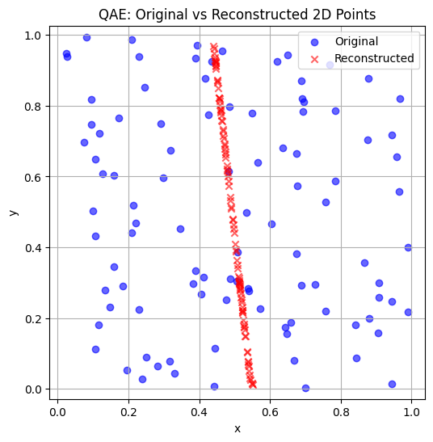
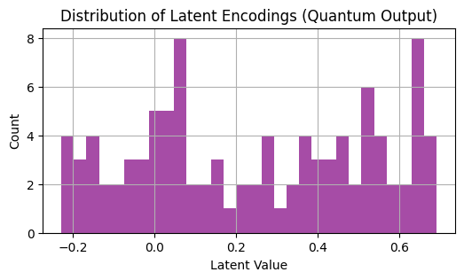
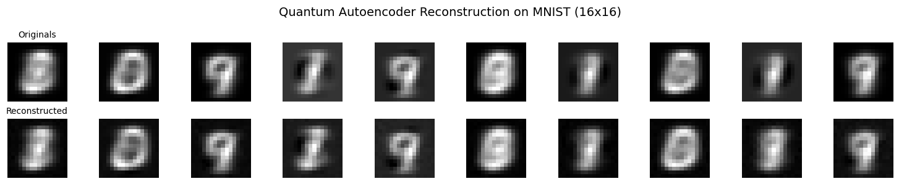

# Quantum Autoencoder

## Objective
The aim of this project was to explore how quantum computing can be used for efficient data compression through Quantum Autoencoders (QAEs). Traditional autoencoders compress classical data using neural networks — here, we attempt to do the same using parameterized quantum circuits. The goal was to learn compressed representations of classical data in quantum states, with minimal information loss.

## Phase 1
- Data: Randomly generated 2D points inside a unit square $[0, 1]^2$.

- Encoding: Each input dimension is encoded using angle encoding via `RY` rotations on a 2-qubit circuit.

- Architecture:

    - Input: 2 classical features mapped to 2 qubits.

    - Quantum Encoder: `RY(x) → RY(θ) → CX` block for entanglement and parameterized compression.

    - Latent Output: Single-value quantum measurement (1D latent representation).

    - Decoder: Classical neural network that reconstructs the original 2D vector from the latent quantum output.

### Result: 
The QAE learned to retain only a narrow feature band of the input space. Most reconstructed points collapse to a lower-dimensional structure — a strong sign that the model effectively compressed the data but lost spatial variance. This demonstrates that the autoencoder identified what it considers “essential” information and discarded the rest.

## Phase 2

- Data: MNIST digits downsampled to 16×16, flattened into 256-dimensional vectors.

- Preprocessing: Normalization to [0, 1], then reshaped to fit into a 2-qubit system by projecting into 2D feature vectors (e.g., via PCA or slicing).

- Encoding: Each 2D input vector was encoded using parameterized `RY` rotations, mapping classical features into quantum angles.

- Quantum Architecture: A 2-qubit parameterized quantum circuit using `RY` gates and a `CX` gate for entanglement.

- Decoder: A classical neural network reconstructs the original 2D point from the 1D latent quantum output.

- Loss Function: Mean Squared Error (MSE) between original and reconstructed vectors (classical fidelity proxy).

### Result:
The quantum autoencoder was able to capture key structural features of the digits. There is clear semantic preservation in almost all reconstructions, suggesting the model learned compressed quantum representations effectively.

Performance Metrics (Epoch 200)
| Metric      | Value        |
|-------------|--------------|
| Loss        | 0.0022       |
| Accuracy    | 95.22%       |
| PSNR        | 26.55 dB     |

