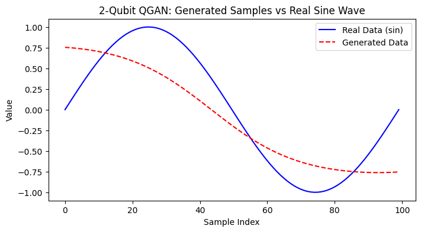

# Quantum Generative Adversarial Network

## Objective

The aim of this project was to explore the potential of Quantum Generative Models for learning complex, low-dimensional representations of structured data.  
This work investigates how QGANs can capture distributions like sine waves and PCA-reduced images, a step toward modeling spectral patterns in exoplanet atmospheres.  

## Phase 1
- Real Data: $y = sin(x)$, sampled over the interval $[0, 2\pi] $

- Generator:
  - Quantum circuit with 2 input noise parameters: $( z_0, z_1 )$
  - 4 trainable parameters: ($\theta_0$, $\theta_1$, $\theta_2$, $\theta_3$)
  - Outputs a value in the range $[-1, 1]$ using a `tanh` activation

- Discriminator: Fully connected classical neural network

- Training:
  - Binary Cross-Entropy (BCE) loss for both Generator and Discriminator
  - Generator is trained 4× for each Discriminator update
  - Noise sampled from uniform distribution over $[0, \pi]^2$

### Result:
The 2-qubit generator successfully approximates the sine wave trend, although slight bias remains. The generator learns periodicity, but with limited amplitude variance due to qubit constraints.

## Phase 2

- Data: MNIST digits ($28 \times 28$) downsampled to $16 \times 16$, then flattened and reduced to 2D using PCA.

- Generator:
  - Quantum circuit with 2 noise parameters: $(z_0, z_1)$
  - 4 trainable parameters: $\theta_0, \dots, \theta_3$
  - Output passed through a classical linear layer to produce 2D points

- Discriminator: Fully connected neural network that classifies 2D samples as real or fake.

- Noise Input: Uniformly sampled from $[0, \pi]^2$

- Training:
  - Binary Cross-Entropy (BCE) loss
  - Learning rate scheduler (StepLR) applied to both generator and discriminator
  - Fréchet Inception Distance (FID) used as the quality metric
  - Early stopping based on FID

### Result:
The quantum generator learned a representation of the PCA-reduced MNIST space and produced plausible 2D encodings that could be inverted to generate MNIST-like digits.

Minimum FID: 0.6529

