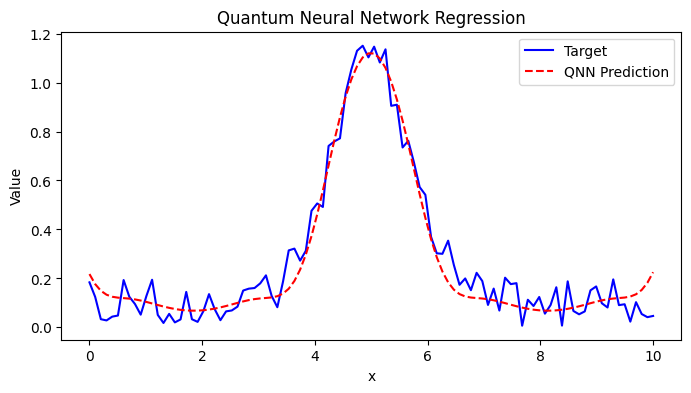
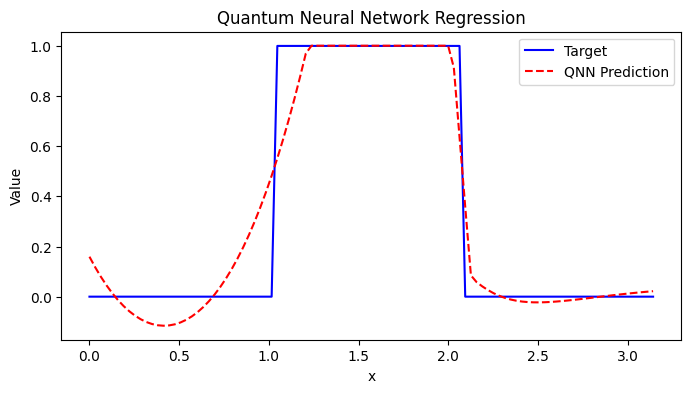
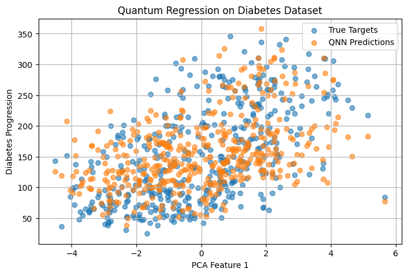

# Quantum Regression

## Objective

This project explores the use of Quantum Neural Networks (QNNs) for function approximation and regression on both synthetic and real-world data.  
In Phase 1, QNNs were tested on mathematical functions to assess their capacity to learn structured and discontinuous mappings.  
In Phase 2, we applied QNNs to biomedical data (diabetes progression) to evaluate their potential in modeling complex, noisy, real-world distributions.

## Phase 1
- Quantum Circuit:
    - Qubits: 1 qubit
    - Input Encoding: $RY(x)$
    - Trainable Parameter: $\theta$ applied via another $RY(\theta)$

- Architecture
    - `EstimatorQNN` wrapped with `TorchConnector`
    - Classical MLP layers on top: $1 \rightarrow 32 \rightarrow 16 \rightarrow 1$
- Loss Function: Mean Squared Error (MSE)

### Result:

The QNN learns the overall shape of the noisy peak and performs smoothing over high-frequency noise.

The QNN approximates the sharp transitions but introduces smooth interpolations due to the limited expressiveness of a single-qubit model.

## Phase 2

- Dataset

    - Source: [`sklearn.datasets.load_diabetes()`](https://scikit-learn.org/stable/datasets/toy_dataset.html#diabetes-dataset)
    - Features: 10 baseline variables describing patients (age, sex, BMI, blood pressure, etc.)
    - Preprocessing:
        - Standardization via `StandardScaler`
        - Reduced to **4 features** using **PCA**
        - Split into batches of size 32 for training

- Quantum Circuit

    - Qubits: 4
    - Input Encoding: $RY(x_i)$ applied to each qubit for the 4 input features
    - Entanglement: Full ring via `cx(i, i+1)` and `cx(3, 0)`
    - Trainable Parameters: Shared across qubits using $RY(\theta_i)$
    - Observables: $Z$ measurement on each qubit (4 total outputs)

- Architecture

    - QNN Layer: `EstimatorQNN` → `TorchConnector`
    - Classical Head:  
    $$
    \text{QNN Output} \in \mathbb{R}^4 \rightarrow \text{Linear}(4 \rightarrow 64) \rightarrow \text{ReLU} \rightarrow \text{Linear}(64 \rightarrow 32) \rightarrow \text{ReLU} \rightarrow \text{Linear}(32 \rightarrow 1)
    $$

    - Loss: Mean Squared Error (MSE)  

### Result:

| Epoch | Loss    | R² Score |
|-------|---------|----------|
| 10    | 4475.80 | 0.3413   |
| 50    | 3500.28 | 0.4660   |
| 70    | 2989.10 | 0.4990   |
| 100   | 2653.81 | 0.5693   |

> The model consistently improved throughout training, reaching a final R² score of **0.5693**, showing that the QNN could capture nonlinear patterns in the dataset using a hybrid architecture.

### Visualization: PCA Feature 1 vs Prediction

- **Blue**: True values (targets)  
- **Orange**: QNN-predicted values  
> The QNN approximates the underlying structure of the data but introduces some scatter due to limited expressivity and qubit count.

